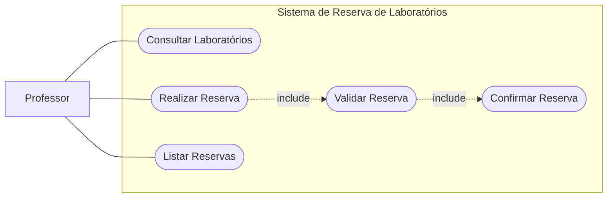

# Diagrama de Casos de Uso — UML 1

## Diagrama Interativo (Mermaid)

```mermaid
flowchart LR
    P[Professor]

    subgraph S["Sistema de Reserva de Laboratórios"]
        RF01(["Consultar Laboratórios"])
        RF02(["Realizar Reserva"])
        RF03(["Validar Reserva"])
        RF04(["Confirmar Reserva"])
        RF05(["Listar Reservas"])

        RF02 -.->|include| RF03
        RF03 -.->|include| RF04
    end

    P --- RF01
    P --- RF02
    P --- RF05
```

