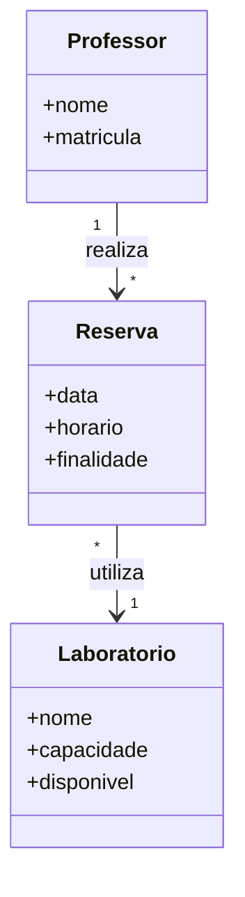

# Diagrama de Classes — UML 2

```mermaid
classDiagram

    class Professor {
        +nome
        +matricula
    }

    class Reserva {
        +data
        +horario
        +finalidade
    }

    class Laboratorio {
        +nome
        +capacidade
        +disponivel
    }

    Professor "1" --> "*" Reserva : realiza
    Reserva "*" --> "1" Laboratorio : utiliza
```
